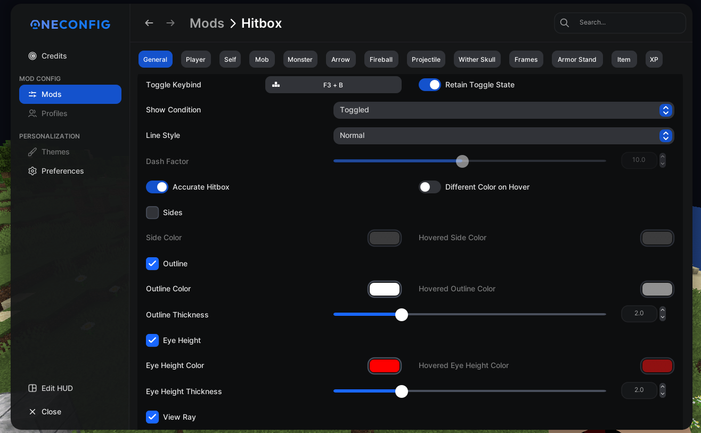

# PolyHitbox

  

A hitbox modification mod

## Features

- Toggle Keybind
- Show Condition - Always / Hovered / Toggled / Never
- Dashed Lines
- Outline
- Eye Height
- View Ray
- Different color when hovered

## Gallery

