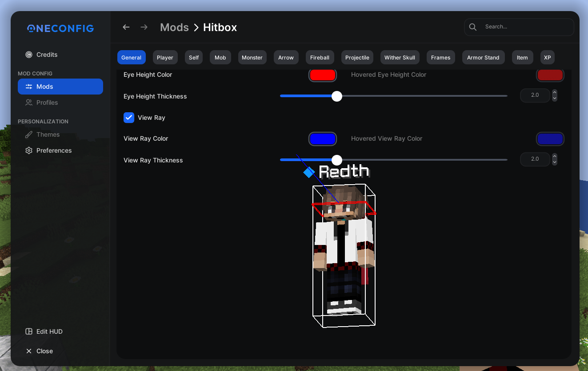

# PolyHitboxes

A hitbox modification mod

## Features

- Toggle Keybind
- Show Condition - Always / Hovered / Toggled / Never
- Line Style - Normal / Proportioned / Dashed
- Hovered Color
- Sides
- Outline
- Eye Height
- View Ray

## Gallery

