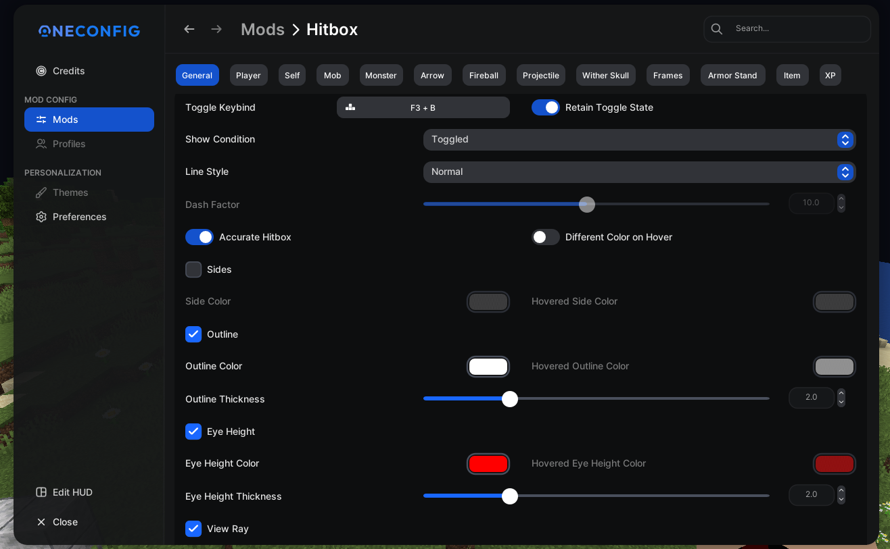
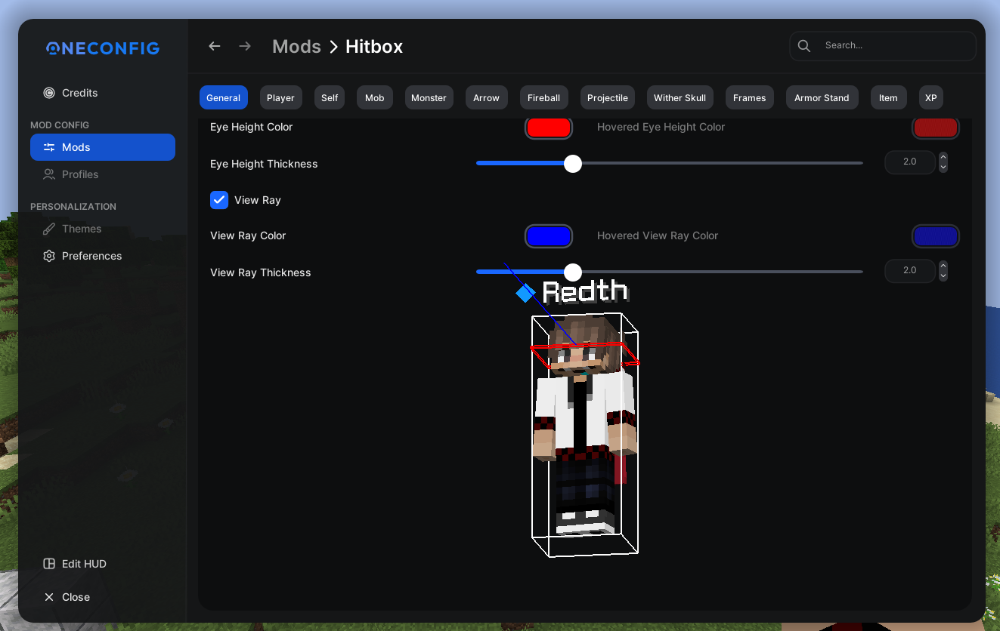

# PolyHitbox

  

A hitbox modification mod

## Features

- Show Condition - Always / Debug (F3+B) / Hovered / Never
- Line Style - Normal / Proportioned / Dashed
- Hovered Color
- Sides
- Outline
- Eye Height
- View Ray
- Different color when hovered

## Gallery

