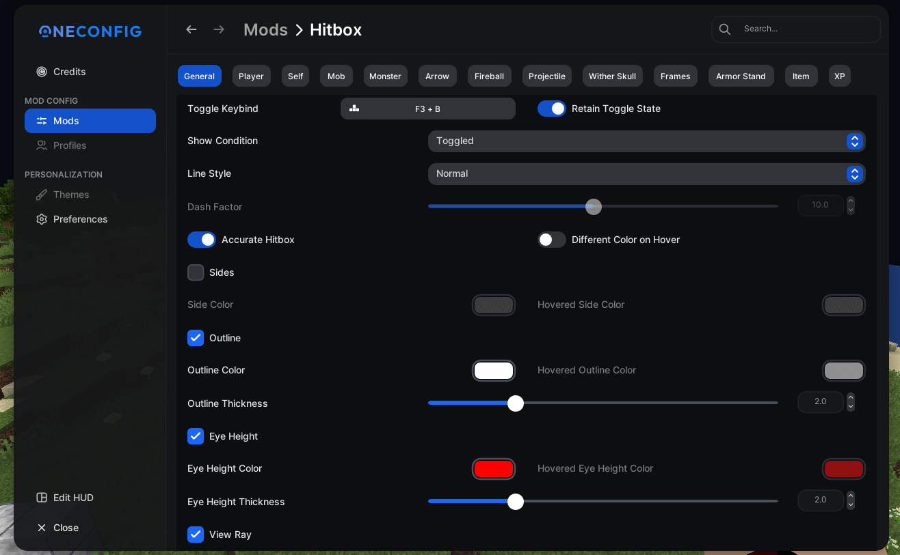
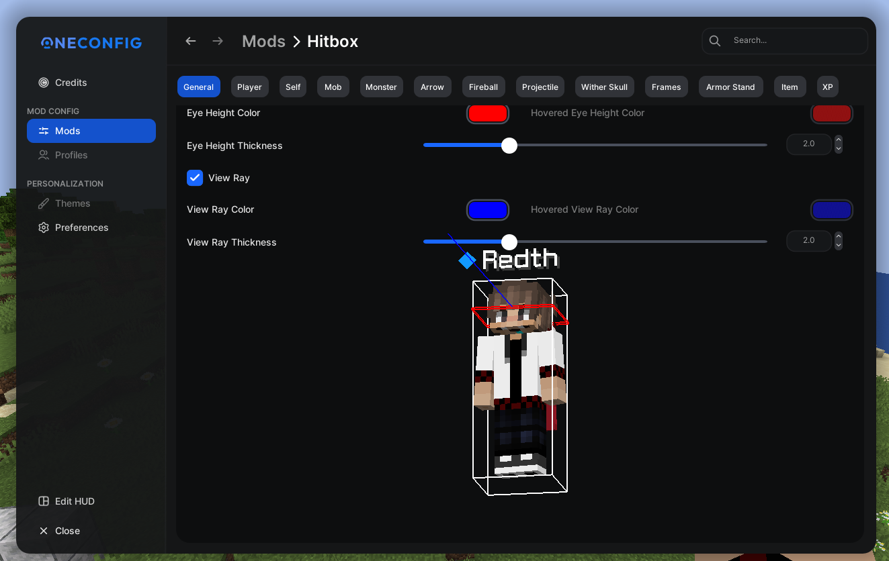

# PolyHitbox

  

A hitbox modification mod

## Features

- Show Condition - Always / Debug (F3+B) / Hovered / Never
- Line Style - Normal / Dashed
- Hovered Color
- Sides
- Outline
- Eye Height
- View Ray
- Different color when hovered
- Different color during invulnerability frames (i-frames)
- Hide with the HUD (F1)

## For mod developers

Other mods can recolour hitboxes per entity through `org.polyfrost.polyhitbox.api.HitboxColors`:

```java
HitboxColors.register((entity, element, argb) ->
    element == HitboxElement.OUTLINE ? myColorFor(entity, argb) : argb);
```

Providers run on the render thread, once per element per visible entity per frame, after the
configured hover and i-frame colours have been applied.

Everything in `org.polyfrost.polyhitbox.api` is stable. Nothing else is — in particular
`render.HitboxRenderer` is private, is rewritten between patch releases, and injecting into it will
break your users' game rather than just your feature.

## Gallery




